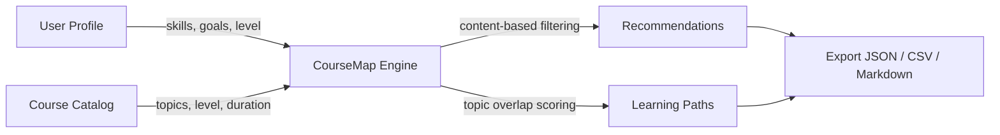
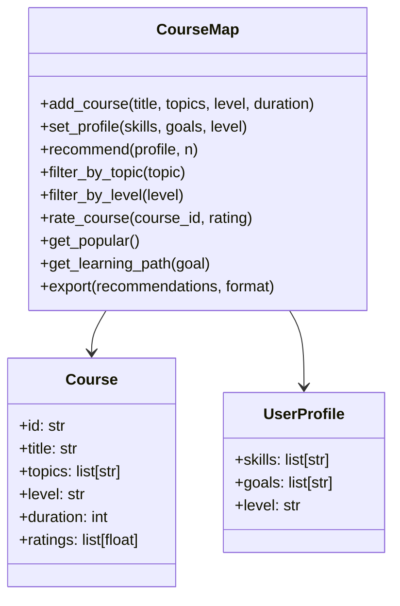

# CourseMap

[](https://github.com/officethree/CourseMap/actions/workflows/ci.yml)
[](https://www.python.org/downloads/)
[](LICENSE)
[](https://github.com/psf/black)

**Course recommendation engine** -- a Python library that recommends courses and learning resources based on user skills, goals, and learning history using content-based filtering.

---

## Architecture





---

## Quickstart

### Installation

```bash
pip install -e .
```

### Usage

```python
from coursemap import CourseMap

engine = CourseMap()

# Add courses to the catalog
engine.add_course("Intro to Python", topics=["python", "programming"], level="beginner", duration=10)
engine.add_course("Machine Learning Basics", topics=["ml", "python", "data-science"], level="intermediate", duration=20)
engine.add_course("Deep Learning with PyTorch", topics=["deep-learning", "pytorch", "ml"], level="advanced", duration=30)
engine.add_course("Data Analysis with Pandas", topics=["pandas", "python", "data-science"], level="beginner", duration=12)

# Set a learner profile
profile = engine.set_profile(
    skills=["python", "statistics"],
    goals=["data-science", "ml"],
    level="intermediate",
)

# Get recommendations
recommendations = engine.recommend(profile, n=3)
for rec in recommendations:
    print(f"{rec.title} (score: {rec.score:.2f})")

# Generate a learning path
path = engine.get_learning_path("ml")
for step in path:
    print(f"  Step: {step.title} [{step.level}]")

# Export results
engine.export(recommendations, format="json")
```

### Running Tests

```bash
make test
```

### Linting

```bash
make lint
```

---

## Configuration

Copy `.env.example` to `.env` and adjust settings as needed:

```bash
cp .env.example .env
```

See [docs/ARCHITECTURE.md](docs/ARCHITECTURE.md) for detailed design documentation.

---

## Contributing

See [CONTRIBUTING.md](CONTRIBUTING.md) for guidelines.

---

*Inspired by AI education recommendation trends*

---

Built by **Officethree Technologies** | Made with love and AI
